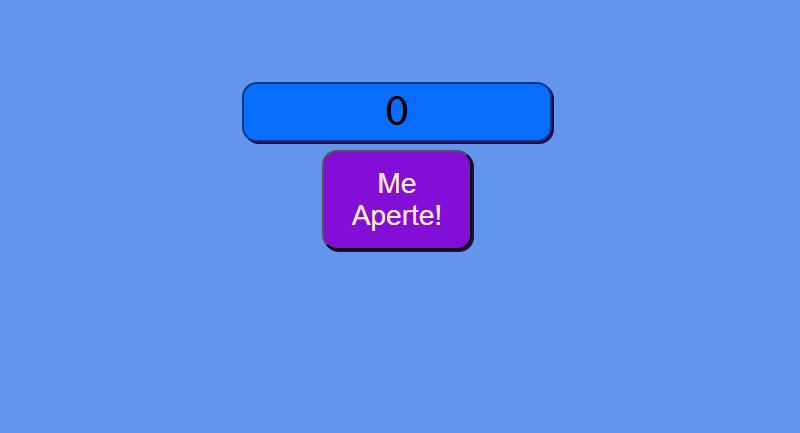
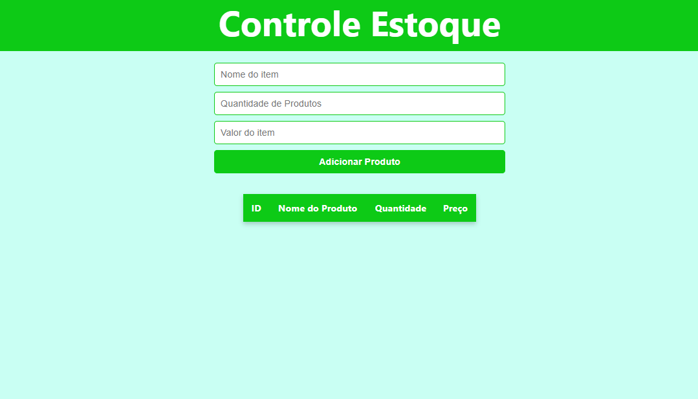

# Projetos: JavaScript

Repositório para aplicação do meu aprendizado de **javascript** em projetos de pequeno escopo.

Para rodar os projetos só precisa clonar o respositório e abrir o arquivo `index.html`.

- **Contador de cliques**: Projeto simples de contar quantos cliques você faz no botão.&nbsp;  
  

---

- **CRUD Controle de Estoque** Projeto simples de CRUD de um controle de estoque, não possui nenhuma forma de DB nele.&nbsp;
  
