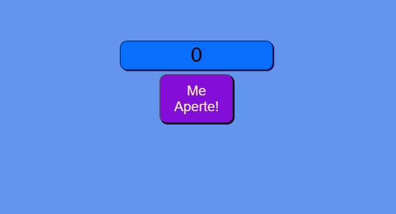

# Pequenos projetos de JavaScript

Aqui estarei postando pequenos projetos que fiz com javascript durante meu aprendizado.

Para rodar os projetos só precisa fazer o download abrir o arquivo index.html e utilizar conforme instruções que estão na tela do projeto.

- **Contador de cliques**: Projeto simples de contar quantos cliques você faz no botão.&nbsp;  
  
